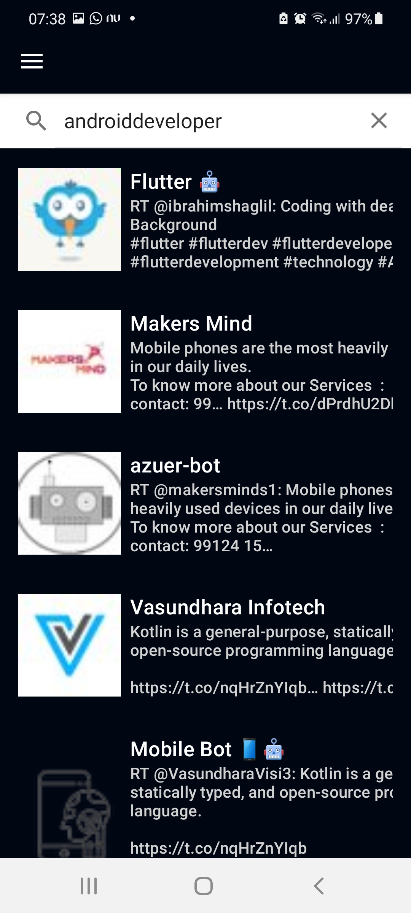
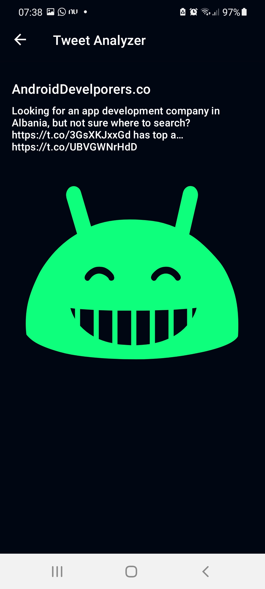
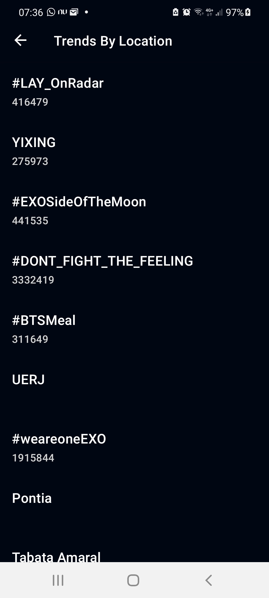

# android-nanodegree-final-project
Android Nanodegree project final Udacity

## Project Instructions
The Apk binary could be found in the folder /apk/twitter_analyzer.apk

To Build the project you should put twitter api key and google language api key in "/keys.properties"

https://developer.twitter.com/en/docs

https://cloud.google.com/natural-language

Variables:
  LANGUAGE_API_KEY = "KEY"

  TWITTER_API_KEY = "Bearer KEY"

## Screens
### Home Screen
Type a query to search tweets. When you click in some tweet item the twitter analyzer screen will open

### Twitter Analyzer
This screen uses natural language google api to analyzer the sentiment of twitter

### Trends By Location
This screen load tweets trends by user location.

